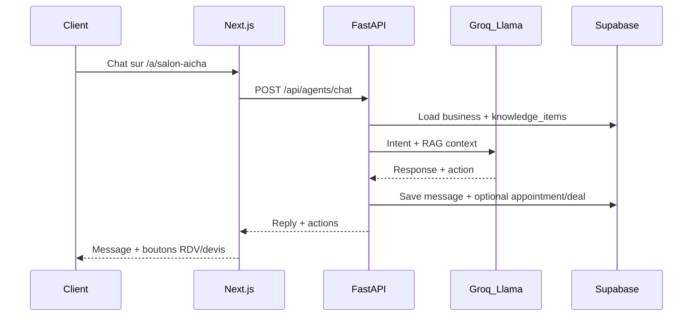

# Plan de développement — Prototype Afroza BizFlow

**Objectif :** livrer un prototype démontrable en **5 minutes** (pitch OSC 2026), centré sur le scénario **Salon Aïcha**, sans intégrations partenaires bloquantes (WhatsApp prod, OM réel).

**Référence :** [RESUME_TECHNIQUE_NEXBIZ.md](./RESUME_TECHNIQUE_NEXBIZ.md)

---

## 1. Périmètre du prototype

### 1.1 Ce que le prototype DOIT prouver

| Capacité | Preuve attendue |
|----------|-----------------|
| Onboarding PME sans paperasse | Créer « Salon Aïcha » en < 2 min |
| Agent IA métier | Cliente demande braids → prix + créneaux |
| Prise de RDV | Créneau confirmé, notification gérant |
| Documents commerciaux | Devis/facture acompte PDF + lien public |
| Encaissement simulé | Page OM simulée → reçu PDF |
| Flow IA / relances | Créance ouverte, relance J+3 déclenchée |
| Marketing léger | Campagne promo + visuel + QR |
| Valeur Orange | Dashboard agrégé + simulateur revenus |

### 1.2 Hors scope prototype (explicitement reporté)

- WhatsApp Business API production (BSP / Meta)
- Orange Money API réelle
- Microcrédit / pré-éligibilité financement (D8)
- Google Business OAuth réel
- Canva Connect avancé
- Max It intégration officielle
- Multi-boutiques (use case 10)
- USSD (use case 12)
- Contrats juridiques (C6)

### 1.3 Scénario fil rouge — Salon Aïcha (Use case 1)

```
1. Gérante crée profil salon
2. Génère lien agent + QR code
3. (Simulé) partage statut WhatsApp
4. Cliente : « Je veux des braids demain »
5. Agent : prix + créneaux disponibles
6. RDV confirmé
7. Facture acompte générée
8. Paiement OM simulé OU marqué manuel
9. Rappel J+3 si impayé (autre facture demo)
10. Feedback post-prestation
11. Dashboard Orange : KPIs mis à jour
```

---

## 2. Architecture cible

### 2.1 Stack

| Couche | Technologie | Hébergement |
|--------|-------------|-------------|
| Frontend PME + public | Next.js 14 (App Router) + Tailwind | Vercel |
| Backend API + IA | FastAPI (Python 3.11+) | Railway / Render / Fly.io |
| Base de données | Supabase (PostgreSQL + Auth + Storage) | Supabase Cloud |
| LLM | Groq API (Llama 3) | Groq |
| PDF | WeasyPrint ou `@react-pdf/renderer` | Généré côté backend |
| QR codes | `qrcode` (npm) | Frontend |
| Bot Telegram | python-telegram-bot | Webhook FastAPI |
| SMS (option P1) | Africa's Talking sandbox | Sandbox uniquement |

### 2.2 Structure monorepo recommandée

```
afroza_bizflow/
├── apps/
│   └── web/                    # Next.js PWA
│       ├── app/
│       │   ├── page.tsx        # Landing /
│       │   ├── demo/           # Scénario guidé
│       │   ├── business/new/   # Onboarding
│       │   ├── a/[slug]/       # Agent public
│       │   ├── b/[slug]/       # Mini-site vitrine
│       │   ├── dashboard/      # PME + cashflow + orange
│       │   ├── campaigns/new/
│       │   ├── quotes/new/
│       │   ├── invoices/[id]/
│       │   ├── orange/simulator/
│       │   └── odc/
│       └── components/
├── services/
│   └── api/                    # FastAPI
│       ├── routers/            # auth, agents, appointments, quotes...
│       ├── agents/               # orchestrator, intent, rag
│       ├── documents/            # pdf generator
│       ├── schedulers/           # relances J+1/J+3/J+7/J+14
│       └── webhooks/             # telegram, sms
├── supabase/
│   └── migrations/             # schéma SQL
├── packages/
│   └── shared/                 # types TypeScript partagés
└── docs/
    ├── RESUME_TECHNIQUE_NEXBIZ.md
    └── PLAN_PROTOTYPE.md
```

### 2.3 Flux technique principal



---

## 3. Schéma Supabase — Phase 1 (MVP)

Créer en priorité ces **12 tables** (le reste en sprint suivant) :

| Priorité | Table | Sprint |
|----------|-------|--------|
| P0 | `businesses` | S1 |
| P0 | `knowledge_items` | S1 |
| P0 | `customers` | S2 |
| P0 | `conversations`, `messages` | S2 |
| P0 | `appointments` | S3 |
| P0 | `leads`, `deals` | S2/S4 |
| P0 | `quotes`, `invoices` | S4 |
| P0 | `payments`, `receipts` | S4/S5 |
| P0 | `debts`, `reminders` | S5 |
| P0 | `campaigns` | S6 |
| P0 | `feedbacks` | S5 |
| P0 | `orange_metrics` | S7 |

**Auth :** Supabase Auth (email/password ou magic link). RLS : chaque gérant ne voit que son `business_id`.

---

## 4. Plan par sprints (9 semaines)

Durée indicative : **1 sprint = 1 semaine** (équipe 2–3 devs). Ajustable en mode solo (×1.5–2).

---

### Sprint S1 — Base produit (Semaine 1)

**Objectif :** fondations + onboarding PME fonctionnel.

| Tâche | Détail | Livrable |
|-------|--------|----------|
| Init monorepo | Next.js + FastAPI + Supabase CLI | Repo structuré |
| Migrations S1 | `businesses`, `knowledge_items`, auth RLS | Schéma déployé |
| Auth gérant | Register / login Supabase | `/api/auth/register` |
| Onboarding UI | Formulaire nom, secteur, ville, services, prix, horaires, ton | `/business/new` |
| Seed demo | Script « Salon Aïcha » pré-rempli | Données test |
| Mini-site public | Page `/b/[slug]` vitrine statique | Lien partageable |

**Critère de done :** créer Salon Aïcha, voir sa page publique, se connecter au dashboard vide.

---

### Sprint S2 — Agent IA (Semaine 2)

**Objectif :** chat public intelligent avec mémoire PME.

| Tâche | Détail | Livrable |
|-------|--------|----------|
| Tables chat | `customers`, `conversations`, `messages`, `leads`, `deals` | Migration |
| Agent orchestrator | FastAPI service : prompt système §22.2 | `/api/agents/chat` |
| Intent classifier | Prompt LLM : prix, RDV, devis, plainte, paiement | Champ `intent` en DB |
| RAG simple | Charger `knowledge_items` + profil business dans contexte | Réponses contextualisées |
| UI chat public | `/a/[slug]` — interface chat responsive | Agent live |
| QR code | Génération QR pointant vers `/a/[slug]` | QR imprimable dashboard |
| Assistant WhatsApp manuel | Bouton « Copier réponse » (A5) | Panel gérant |

**Critère de done :** cliente tape « combien pour des braids ? » → agent répond avec prix du salon.

---

### Sprint S3 — Rendez-vous (Semaine 3)

**Objectif :** prise de RDV automatisée.

| Tâche | Détail | Livrable |
|-------|--------|----------|
| Table appointments | Créneaux, statuts, rappels | Migration |
| Calendrier gérant | UI disponibilités (créneaux récurrents simples) | Dashboard settings |
| Action agent RDV | Intent `appointment` → propose 3 créneaux | Flow chat |
| Confirmation RDV | POST `/api/appointments` | RDV en DB |
| Notification gérant | Toast / email / Telegram (basique) | Alert gérant |
| Rappel client | Job planifié 24h avant (cron ou Supabase pg_cron) | Reminder S5 si temps |

**Critère de done :** conversation → choix créneau → RDV confirmé visible dashboard.

---

### Sprint S4 — Documents commerciaux (Semaine 4)

**Objectif :** devis, factures, reçus PDF.

| Tâche | Détail | Livrable |
|-------|--------|----------|
| Tables quotes/invoices | + Storage Supabase pour PDFs | Migration |
| Document Engine | Template PDF salon (logo, lignes, totaux) | WeasyPrint |
| Génération devis | POST `/api/quotes/generate` depuis deal | `/quotes/new` |
| Facture acompte | Depuis devis accepté | `/invoices/[id]` public |
| Lien public sécurisé | Token UUID sur facture/devis | Page client |
| Statut ouvert | Tracking `opened_at` (pixel ou fetch) | Analytics devis |

**Critère de done :** devis PDF téléchargeable + facture acompte avec lien public.

---

### Sprint S5 — Cashflow & relances (Semaine 5)

**Objectif :** créances, paiement simulé, relances J+1–J+14.

| Tâche | Détail | Livrable |
|-------|--------|----------|
| Tables payments/receipts/debts/reminders | + `cashflow_entries` | Migration |
| Paiement OM simulé | POST `/api/payments/simulate` — page style Orange Money | UI paiement |
| Reçu PDF | Auto-généré après paiement simulé | PDF reçu |
| Créance auto | Facture impayée → `debts` status open | D1 |
| Scheduler relances | J+1 poli, J+3 ferme, J+7 urgent, J+14 alerte gérant | `/api/reminders/schedule` |
| Dashboard cashflow | `/dashboard/cashflow` — montant à encaisser, retards | Vue gérant |
| Feedback auto | POST feedback après RDV/paiement | E1 basique |
| Marquage manuel | Bouton « Marquer payé » pour terrain | Fallback sans OM |

**Critère de done :** facture impayée → relance J+3 générée ; autre facture → OM simulé → reçu.

---

### Sprint S6 — Marketing (Semaine 6)

**Objectif :** contenu IA + visuel promo + SMS simulateur.

| Tâche | Détail | Livrable |
|-------|--------|----------|
| Génération contenu | POST `/api/campaigns/generate` — post, SMS, hashtags | `/campaigns/new` |
| Creative Engine v1 | Template HTML → PNG (Playwright screenshot) | Visuel + QR intégré |
| Campagne SMS simulateur | Pas d'envoi réel : statut « simulé » + rapport | A4 P0 |
| Copier WhatsApp | Texte promo prêt à coller | A5 |
| Historique campagnes | Table `campaigns` + métriques fictives demo | Dashboard |

**Critère de done :** générer visuel promo « -20% braids samedi » avec QR agent.

---

### Sprint S7 — Dashboards Orange (Semaine 7)

**Objectif :** prouver la valeur Orange sans données sensibles.

| Tâche | Détail | Livrable |
|-------|--------|----------|
| Dashboard PME | KPIs : RDV, devis, factures, cash, campagnes | `/dashboard` |
| Agrégation Orange | Table `orange_metrics` — calcul depuis activité consentie | `/dashboard/orange` |
| Simulateur revenus | Inputs : nb PME, prix pack, SMS moyen, taux conversion | `/orange/simulator` |
| Dashboard ODC | Score progression entrepreneurs (données demo) | `/odc` |
| Rapport hebdo IA | Résumé Groq des KPIs semaine (optionnel P1) | PDF ou Telegram |

**Critère de done :** après démo Salon Aïcha, dashboard Orange affiche SMS générés, OM potentiel, PME actives.

---

### Sprint S8 — Canaux secondaires (Semaine 8)

**Objectif :** Telegram bot + SMS sandbox (si temps).

| Tâche | Détail | Livrable |
|-------|--------|----------|
| Telegram bot | Webhook `/api/webhooks/telegram` → même agent | Bot live |
| Lien agent Telegram | `t.me/BotName?start=salon-aicha` | QR alternatif |
| Africa's Talking sandbox | Envoi SMS test relance J+3 | Sandbox only |
| WhatsApp copier-coller | Renforcer A5 — pas d'API | Panel amélioré |

**Critère de done :** message Telegram → même réponse agent que web.

**Note :** si retard, S8 est **optionnel** pour le pitch — Web + QR suffisent (P0).

---

### Sprint S9 — Démo & polish (Semaine 9)

**Objectif :** scénario pitch 5 minutes bulletproof.

| Tâche | Détail | Livrable |
|-------|--------|----------|
| Page `/demo` | Wizard guidé 11 étapes Salon Aïcha | Scénario interactif |
| Landing `/` | Promesse, modules, valeur Orange, CTA demo | Pitch visuel |
| Données reset | Bouton « Reset demo » pour rejouer pitch | Fiabilité demo |
| Mode offline backup | Screenshots / vidéo enregistrée | Plan B OSC |
| Deploy production | Vercel + API + Supabase prod | URL publique |
| Tests parcours | Checklist 5 min (§17.3 doc) | QA validée |
| Documentation pitch | Script oral + timing par étape | Support présentation |

**Checklist démo 5 min (§17.3) :**

- [ ] Créer / charger Salon Aïcha
- [ ] Montrer lien agent + QR
- [ ] Simuler cliente « braids demain »
- [ ] Confirmer RDV
- [ ] Générer facture/acompte
- [ ] Simuler paiement Orange Money
- [ ] Afficher facture impayée + relance J+3
- [ ] Générer campagne promo + visuel
- [ ] Ouvrir dashboard Orange — gains visibles

---

## 5. Routes Next.js — mapping sprint

| Route | Sprint | Priorité |
|-------|--------|----------|
| `/` | S9 | P0 |
| `/demo` | S9 | P0 |
| `/business/new` | S1 | P0 |
| `/b/[slug]` | S1 | P0 |
| `/a/[slug]` | S2 | P0 |
| `/dashboard` | S7 | P0 |
| `/dashboard/cashflow` | S5 | P0 |
| `/dashboard/orange` | S7 | P0 |
| `/campaigns/new` | S6 | P0 |
| `/quotes/new` | S4 | P0 |
| `/invoices/[id]` | S4/S5 | P0 |
| `/orange/simulator` | S7 | P0 |
| `/odc` | S7 | P1 |

---

## 6. Endpoints API — ordre d'implémentation

```
S1  POST /api/auth/register
    POST /api/businesses

S2  POST /api/agents/chat
    POST /api/leads/qualify

S3  POST /api/appointments
    GET  /api/appointments

S4  POST /api/quotes/generate
    POST /api/invoices
    GET  /api/invoices

S5  POST /api/payments/simulate
    GET  /api/debts
    POST /api/reminders/schedule

S6  POST /api/campaigns/generate
    POST /api/design/render

S7  GET  /api/dashboard/pme
    GET  /api/dashboard/orange
    GET  /api/dashboard/odc

S8  POST /api/webhooks/telegram
    POST /api/webhooks/sms
```

---

## 7. Variables d'environnement

```env
# Supabase
NEXT_PUBLIC_SUPABASE_URL=
NEXT_PUBLIC_SUPABASE_ANON_KEY=
SUPABASE_SERVICE_ROLE_KEY=

# Backend
GROQ_API_KEY=
API_BASE_URL=

# Telegram (S8)
TELEGRAM_BOT_TOKEN=

# SMS sandbox (S8, optionnel)
AFRICAS_TALKING_API_KEY=
AFRICAS_TALKING_USERNAME=

# App
NEXT_PUBLIC_APP_URL=https://votre-app.vercel.app
DEMO_MODE=true
PAYMENT_MODE=simulated
```

---

## 8. Principes de développement prototype

1. **Simulateur d'abord** — OM et SMS en mode simulé ; jamais bloquer la démo sur une API externe.
2. **Un scénario, une vérité** — Salon Aïcha est la référence ; les autres use cases viennent après.
3. **Backend mince, IA riche** — la valeur est dans l'orchestration agent, pas dans 50 écrans.
4. **RLS Supabase strict** — isolation données PME dès S1.
5. **Pas de WhatsApp API** — copier-coller uniquement jusqu'à P2.
6. **Dashboard Orange = agrégats** — pas de données sensibles Orange ; calcul local depuis activité NexBiz.
7. **Reset demo** — indispensable pour pitch répétable.

---

## 9. Jalons et livrables

| Jalon | Fin sprint | Livrable clé |
|-------|------------|--------------|
| **M1 — Fondations** | S1 | Onboarding + mini-site Salon Aïcha |
| **M2 — Agent live** | S2 | Chat public + QR fonctionnels |
| **M3 — Cycle commercial** | S4 | RDV + devis + facture PDF |
| **M4 — Cashflow** | S5 | OM simulé + relances + dashboard cash |
| **M5 — Pitch ready** | S9 | Démo 5 min sur Vercel |

---

## 10. Estimation ressources

| Profil | Charge | Rôle |
|--------|--------|------|
| Dev fullstack | 100% × 9 sem | Next.js + FastAPI + Supabase |
| Dev IA / backend | 50% × 9 sem | Agent, prompts, PDF, schedulers |
| Design UI | 25% × 4 sem | Landing, dashboard, templates PDF |
| Product / pitch | 10% × 9 sem | Scénario demo, script OSC |

**Mode solo :** compacter S7+S8, viser **6–7 semaines** en priorisant strictement P0.

---

## 11. Risques prototype et mitigations

| Risque | Mitigation |
|--------|------------|
| LLM instable / lent | Groq + prompts courts ; réponses fallback pré-écrites pour demo |
| PDF complexe | Template minimal WeasyPrint ; pas de mise en page avancée |
| Scope creep | Liste P0 affichée §15.1 doc — tout le reste = backlog |
| Démo casse en live | `/demo` guidé + reset + vidéo backup S9 |
| Supabase quotas | Seed léger ; pas de load test |

---

## 12. Prochaine action immédiate

**Semaine 0 (setup — 2 jours) :**

1. `npx create-next-app@latest apps/web --typescript --tailwind --app`
2. Initialiser FastAPI dans `services/api`
3. Créer projet Supabase + migrations S1 (`businesses`, `knowledge_items`)
4. Connecter auth Supabase au frontend
5. Implémenter `/business/new` + seed Salon Aïcha

**Commande de démarrage suggérée :**

```bash
cd afroza_bizflow
# Puis scaffolding monorepo selon structure §2.2
```

---

## 13. Lien avec les modules doc

| Sprint | Modules couverts |
|--------|------------------|
| S1 | A7 mini-site, onboarding |
| S2 | B1, B2, B3, A5 |
| S3 | B4 |
| S4 | C1, C3, C4 |
| S5 | D1, D2, D3, E1 |
| S6 | A1, A2, A4 (simulateur) |
| S7 | F1, F3, F5, F4 (basique) |
| S8 | B6 Telegram, A4 sandbox |
| S9 | Démo intégrée — tous modules P0 |

---

*Plan aligné sur Afroza BizFlow NexBiz + Flow IA | OSC 2026 — prototype P0, scénario Salon Aïcha.*
