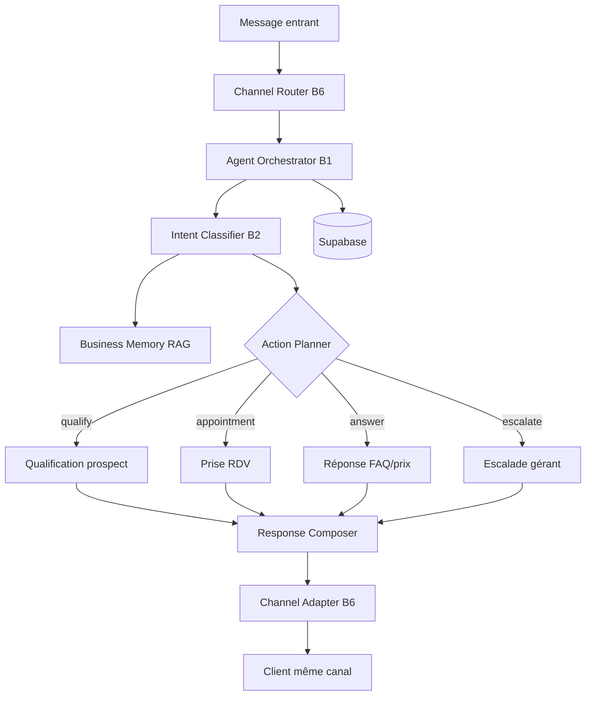

# Procédure complète — Module Agent IA (B1–B6)

**Profil cible :** spécialiste Data / IA  
**Périmètre :** Agent métier par PME, classification d'intentions, qualification, RDV, escalade, multicanal  
**Stack :** FastAPI + Supabase + Groq/Llama + embeddings (option pgvector)

---

## 0. Vue d'ensemble — ce que vous construisez

L'Agent IA n'est **pas** un simple chatbot. C'est un **pipeline décisionnel** :



**Votre zone Data/IA :** prompts, RAG, intents, scores confiance, extraction entités, règles escalade, évaluation qualité.

---

## Phase 1 — Fondations données (Jour 1–2)

### 1.1 Tables Supabase agent (minimum viable)

Exécuter la migration `supabase/migrations/001_agent_core.sql` (fournie dans le repo).

| Table | Rôle IA |
|-------|---------|
| `businesses` | Contexte métier : secteur, ton, langue, slug |
| `knowledge_items` | Base RAG : FAQ, services, prix, politiques |
| `customers` | Identité client multicanal |
| `conversations` | Session unifiée par canal |
| `messages` | Historique + intent + confidence par message |
| `leads` | Output B3 — prospect structuré |
| `appointments` | Output B4 — RDV confirmés |

### 1.2 Modèle de connaissance PME (RAG)

Chaque PME alimente des `knowledge_items` typés :

| type | Exemple contenu |
|------|-----------------|
| `service` | « Braids — 15 000 FCFA — 3h » |
| `faq` | « Acceptez-vous Mobile Money ? Oui, acompte 50% » |
| `policy` | « Annulation : 24h avant, sinon acompte conservé » |
| `hours` | « Lun-Sam 9h-19h, Dim fermé » |
| `tone` | « Tutoiement, chaleureux, pro » |

**Procédure ingestion :**

1. À la création business → générer items depuis formulaire onboarding
2. Optionnel P1 → embeddings vectoriels (`embedding vector(1536)`) + recherche pgvector
3. MVP → recherche full-text PostgreSQL (`to_tsvector`) suffit

### 1.3 Seed Salon Aïcha (dataset test)

```json
{
  "name": "Salon Aïcha",
  "sector": "coiffure",
  "city": "Abidjan",
  "tone": "chaleureux",
  "language": "fr",
  "knowledge_items": [
    {"type": "service", "title": "Braids", "content": "15000 FCFA, durée 3h, acompte 5000"},
    {"type": "service", "title": "Tissage", "content": "12000 FCFA, durée 2h30"},
    {"type": "hours", "title": "Horaires", "content": "Lun-Sam 9h-19h"},
    {"type": "policy", "title": "Acompte", "content": "50% à la réservation"}
  ]
}
```

---

## Phase 2 — Intent Classifier B2 (Jour 3–4)

### 2.1 Taxonomie des intents (fermée)

| Intent | Description | Action downstream |
|--------|-------------|-------------------|
| `price_inquiry` | Demande de prix | RAG services |
| `availability` | Disponibilité / horaires | RAG hours + B4 |
| `appointment` | Veut réserver | B4 |
| `quote_request` | Demande devis formel | B3 → C1 |
| `payment_question` | Question paiement | RAG policy |
| `complaint` | Plainte / insatisfaction | **B5 escalate** |
| `discount_request` | Demande remise | **B5 escalate** |
| `legal_question` | Juridique | **B5 escalate** |
| `general_info` | Info générale | RAG FAQ |
| `greeting` | Salutation | Réponse accueil |
| `unknown` | Non compris | Clarification ou B5 si répété |

### 2.2 Prompt classifier (structured output JSON)

```text
Tu es un classificateur d'intentions pour {business_name} ({sector}).

Message client : "{user_message}"
Contexte conversation (3 derniers messages) : {history}

Réponds UNIQUEMENT en JSON :
{
  "intent": "<intent_id>",
  "confidence": 0.0-1.0,
  "entities": {
    "service": null,
    "date_preference": null,
    "budget": null
  },
  "needs_clarification": false,
  "clarification_question": null
}
```

### 2.3 Règles post-LLM (deterministes)

Appliquer **après** le LLM, jamais avant :

```python
ESCALATE_INTENTS = {"complaint", "discount_request", "legal_question"}
ESCALATE_IF_CONFIDENCE_BELOW = 0.55
ESCALATE_IF_UNKNOWN_TWICE = True  # 2 unknown consécutifs → B5
```

### 2.4 Métriques à tracker

| Métrique | Cible MVP |
|----------|-----------|
| Intent accuracy (eval set) | > 85% |
| Confidence calibration | escalades < 15% des messages |
| Latence classifier | < 800 ms |

**Dataset eval :** créer 50–100 paires `(message, intent_attendu)` par secteur test.

---

## Phase 3 — Business Memory / RAG (Jour 5–6)

### 3.1 Pipeline RAG MVP (sans vector DB)

```
1. Classifier intent → détermine types knowledge à chercher
2. SELECT knowledge_items WHERE business_id = X AND type IN (...)
3. Injecter top 5 items dans prompt réponse
4. LLM génère réponse ancrée sur ces items uniquement
```

### 3.2 Pipeline RAG P1 (pgvector)

```
1. Embed query client (same model que items)
2. similarity search top-k=5, seuil > 0.75
3. Re-rank par type intent
4. Inject context + citation interne
```

### 3.3 Contraintes anti-hallucination

Dans le prompt système (§22.2 doc) :

- « Réponds UNIQUEMENT avec les informations du CONTEXTE PME »
- « Si prix absent du contexte → propose escalade ou demande clarification »
- « Ne jamais inventer un créneau RDV — utiliser AVAILABLE_SLOTS »

### 3.4 Format contexte injecté

```text
=== CONTEXTE PME ===
Services :
- Braids : 15000 FCFA, 3h, acompte 5000
- Tissage : 12000 FCFA, 2h30

Horaires : Lun-Sam 9h-19h

Politiques :
- Acompte 50% à la réservation

=== CRÉNEAUX DISPONIBLES ===
{slots_from_supabase}

=== HISTORIQUE CLIENT ===
{last_5_messages}
```

---

## Phase 4 — Agent Orchestrator B1 (Jour 7–9)

### 4.1 Contrat API principal

**POST `/api/agents/chat`**

Request :
```json
{
  "business_slug": "salon-aicha",
  "channel": "web",
  "customer_ref": "uuid-or-anonymous",
  "message": "Bonjour, je veux des braids demain",
  "conversation_id": "optional-uuid"
}
```

Response :
```json
{
  "conversation_id": "uuid",
  "reply": "Bonjour ! Les braids sont à 15 000 FCFA...",
  "intent": "appointment",
  "confidence": 0.91,
  "actions": [
    {"type": "propose_slots", "slots": ["2026-06-07T10:00", "2026-06-07T14:00"]}
  ],
  "escalated": false,
  "metadata": {"model": "llama-3.3-70b", "latency_ms": 620}
}
```

### 4.2 Algorithme orchestrator (pseudo-code)

```python
async def handle_chat(request):
    business = load_business(request.business_slug)
    conversation = get_or_create_conversation(...)
    save_message(inbound=request.message)

    # B2
    classification = await classify_intent(
        message=request.message,
        history=conversation.last_n(5),
        business=business
    )
    save_message_intent(classification)

    # B5 — règles escalade
    if should_escalate(classification, conversation):
        return await escalate_to_manager(conversation, classification)

    # Action routing
    match classification.intent:
        case "appointment":
            return await handle_appointment(...)
        case "quote_request":
            return await handle_qualification(...)  # B3
        case _:
            return await handle_rag_answer(...)     # B1

    save_message(outbound=reply)
    return response
```

### 4.3 Prompt système agent (production)

Voir `services/api/agents/prompts/system_agent.txt` — basé sur §22.2 doc avec variables :

- `{business_name}`, `{sector}`, `{tone}`, `{language}`
- `{payment_mode}` = `simulated` | `manual` | `live`
- `{partner_finance_enabled}` = false en MVP

---

## Phase 5 — Qualification prospect B3 (Jour 10–11)

### 5.1 Slots à extraire (entity filling)

| Slot | Obligatoire pour deal | Question si manquant |
|------|----------------------|----------------------|
| `need` | Oui | « Pouvez-vous décrire votre besoin ? » |
| `budget` | Non | « Avez-vous un budget en tête ? » |
| `deadline` | Non | « Pour quand souhaitez-vous ? » |
| `location` | Non | « Vous êtes dans quel quartier ? » |
| `contact` | Oui (fin) | « Numéro WhatsApp pour le devis ? » |

### 5.2 State machine qualification

```
START → COLLECT_NEED → COLLECT_BUDGET → COLLECT_DEADLINE → COLLECT_CONTACT → CREATE_LEAD
```

Stocker l'état dans `conversations.metadata` (JSONB).

### 5.3 Output B3 — création lead + deal

```python
lead = {
    "business_id": ...,
    "customer_id": ...,
    "need": extracted.need,
    "budget": extracted.budget,
    "deadline": extracted.deadline,
    "score": compute_priority_score(...),  # 0-100
    "status": "qualified"
}
deal = create_deal(stage="prospect", lead_id=lead.id, amount=estimated)
```

**Score priorité (règle simple) :**
- budget connu + deadline < 7j → score 80+
- besoin clair seul → score 50
- vague → score 30, demander clarification

---

## Phase 6 — Prise de RDV B4 (Jour 12–13)

### 6.1 Données disponibilités

Table `appointments` + config business :

```json
{
  "slot_duration_minutes": 180,
  "working_hours": {"mon": ["09:00","19:00"], ...},
  "buffer_minutes": 15
}
```

### 6.2 Algorithme créneaux

```python
def get_available_slots(business_id, service, date_range):
    booked = query_appointments(business_id, date_range)
    free = subtract_from_working_hours(booked)
    return free[:3]  # proposer max 3 créneaux
```

### 6.3 Flow conversationnel RDV

```
Client: "braids demain"
→ Intent: appointment, entity: service=braids, date=tomorrow
→ Agent: "Demain j'ai 10h ou 14h. Le tarif est 15 000 FCFA, acompte 5 000. Lequel préférez-vous ?"
Client: "10h"
→ Action: confirm_appointment
→ DB: appointments.status = confirmed
→ Notify manager + schedule reminder 24h before
```

### 6.4 Actions UI (web chat)

Boutons quick-reply côté frontend :
- `[Confirmer 10h]` `[Confirmer 14h]` `[Parler au gérant]`

---

## Phase 7 — Escalade humaine B5 (Jour 14)

### 7.1 Déclencheurs (OR logique)

| Condition | Action |
|-----------|--------|
| intent ∈ ESCALATE_INTENTS | Escalade immédiate |
| confidence < 0.55 | Escalade |
| 2× `unknown` consécutifs | Escalade |
| client dit « parler au gérant » | Escalade |
| montant > seuil configurable | Escalade |

### 7.2 Output escalade

```json
{
  "escalated": true,
  "reply": "Je transmets votre demande à Aïcha. Elle vous répondra sous peu.",
  "manager_notification": {
    "summary": "Cliente demande remise 30% sur braids — historique 3 msgs",
    "priority": "high",
    "conversation_id": "..."
  }
}
```

### 7.3 Résumé conversation (LLM)

Prompt court : résumer en 3 bullet points pour le gérant (pas pour le client).

---

## Phase 8 — Channel Router B6 (Jour 15–16)

### 8.1 Normalisation entrée

Tous les canaux produisent un `AgentChatRequest` unifié :

| Canal | customer_ref | channel |
|-------|--------------|---------|
| Web `/a/[slug]` | cookie uuid | `web` |
| Telegram | telegram_user_id | `telegram` |
| SMS (P1) | phone number | `sms` |
| WhatsApp manuel (A5) | copié par gérant | `whatsapp_manual` |

### 8.2 Historique unifié

Même `customer_id` si phone/email match → fusion conversations.

### 8.3 Channel Adapter sortie

| Canal | Format sortie |
|-------|---------------|
| web | text + action buttons |
| telegram | markdown + inline keyboard |
| sms | text 160 chars max, pas de boutons |

---

## Phase 9 — Évaluation & observabilité (Jour 17–18)

### 9.1 Logs structurés (chaque requête)

```json
{
  "trace_id": "uuid",
  "business_id": "...",
  "intent": "appointment",
  "confidence": 0.91,
  "escalated": false,
  "latency_ms": 620,
  "tokens_in": 840,
  "tokens_out": 120,
  "rag_items_used": 3
}
```

### 9.2 Eval suite ( votre spécialité Data )

| Test | Méthode |
|------|---------|
| Intent accuracy | 100 messages labellisés → accuracy / F1 par intent |
| Hallucination prix | 20 questions hors contexte → doit escalader ou dire « je ne sais pas » |
| RDV end-to-end | 10 scénarios → RDV DB correct |
| Escalade | 15 cas limites → 100% escalade attendue |
| Latence P95 | < 2s sur Groq |

### 9.3 Dashboard qualité (option)

Table `agent_eval_runs` ou export CSV vers notebook Python.

---

## Phase 10 — Intégration frontend (Jour 19–20)

### 10.1 Page `/a/[slug]`

- Composant `AgentChat` → POST `/api/agents/chat`
- Affiche actions (`propose_slots`, `confirm_appointment`)
- Bouton « Copier pour WhatsApp » (A5)

### 10.2 Test scénario Salon Aïcha

| Étape | Message test | Résultat attendu |
|-------|--------------|------------------|
| 1 | « Bonjour » | greeting + présentation salon |
| 2 | « Prix braids ? » | 15 000 FCFA + durée |
| 3 | « Demain possible ? » | 2–3 créneaux |
| 4 | « 10h » | RDV confirmé |
| 5 | « Remise 50% » | escalade B5 |
| 6 | « C'est illégal » | escalade B5 |

---

## Checklist livraison Agent IA complet

### B1 — Agent métier
- [ ] Prompt système par business
- [ ] RAG context injection
- [ ] Réponses ancrées contexte
- [ ] Historique 5+ messages

### B2 — Intents
- [ ] 11 intents taxonomie
- [ ] JSON structured output
- [ ] confidence score
- [ ] règles post-LLM

### B3 — Qualification
- [ ] State machine slots
- [ ] Création lead + deal
- [ ] Score priorité

### B4 — RDV
- [ ] Calcul créneaux
- [ ] Confirmation DB
- [ ] Notification gérant

### B5 — Escalade
- [ ] 5 déclencheurs
- [ ] Résumé manager
- [ ] Message attente client

### B6 — Multicanal
- [ ] Web chat
- [ ] Telegram webhook (option S8)
- [ ] Historique unifié

### Data / IA
- [ ] Eval set 100 messages
- [ ] Logs trace_id
- [ ] Anti-hallucination prix
- [ ] Seed Salon Aïcha

---

## Ordre d'exécution recommandé (votre profil Data/IA)

```
Semaine 1 : Phase 1 (data) + Phase 2 (intents) + eval set
Semaine 2 : Phase 3 (RAG) + Phase 4 (orchestrator)
Semaine 3 : Phase 5–7 (B3, B4, B5) + Phase 9 (eval)
Semaine 4 : Phase 8 (canaux) + Phase 10 (frontend) + polish
```

**Commencez par :** migration Supabase → seed Salon Aïcha → classifier seul → eval accuracy → puis orchestrator.

---

## Fichiers code (démarrage)

```
services/api/
├── main.py                      # FastAPI app
├── routers/agents.py            # POST /api/agents/chat
├── agents/
│   ├── orchestrator.py          # Pipeline B1
│   ├── classifier.py            # B2
│   ├── rag.py                   # Business memory
│   ├── qualification.py         # B3
│   ├── appointments.py          # B4
│   ├── escalation.py            # B5
│   ├── channel_router.py        # B6
│   └── prompts/
│       ├── system_agent.txt
│       └── intent_classifier.txt
├── models/schemas.py            # Pydantic
└── db/supabase_client.py
```

---

*Procédure alignée Afroza BizFlow — Module 2 Agent IA (B1–B6) | OSC 2026*
