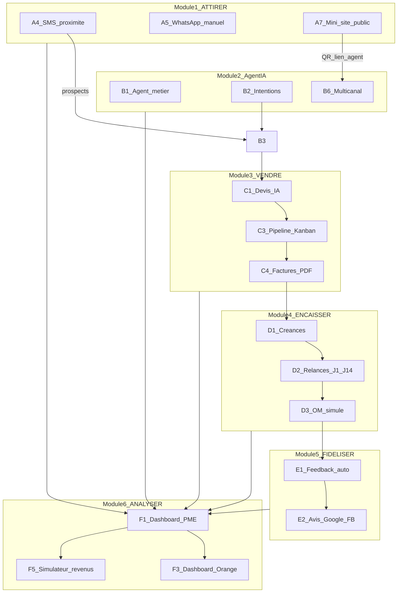
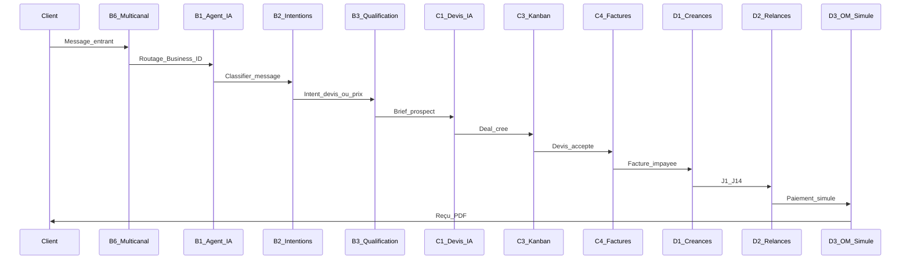

# Résumé technique — Afroza BizFlow NexBiz + Flow IA

**Source :** Afroza BizFlow NexBiz + Flow IA | OSC 2026  
**Périmètre documenté :** pages 12 à 24 et 26 à 39 sur 39 (modules A1–F6, use cases, architecture, MVP, roadmap)  
**Langue :** français | **Format :** résumé technique détaillé

> **Note de couverture :** les pages 1 à 11 (vision, positionnement OSC 2026) et la page 25 (matrice exhaustive intermédiaire) n’ont pas été reçues. Ce résumé consolide l’intégralité du contenu disponible.

---

## 1. Vue d’ensemble produit

**NexBiz** est une plateforme digitale destinée aux PME (petites et moyennes entreprises), conçue pour couvrir l’ensemble du cycle commercial :

```
Visibilité → Conversation → Vente → Encaissement → Fidélisation → Pilotage
```

**Flow IA** désigne la couche intelligente de gestion de trésorerie et de cashflow (Module 4 — ENCAISSER), avec des fonctionnalités vocales, prédictives et de scoring client.

**Partenaire stratégique cible : Orange**, via plusieurs leviers :
- **Orange Business** — packs PME, dashboards commerciaux
- **Orange Money** — paiements simulés (MVP) puis réels (post-partenariat)
- **SMS B2B** — campagnes, relances, trafic récurrent
- **Max It** — intégration future mini-app
- **ODC** (Orange Digital Center) — mesure d’impact post-formation entrepreneurs

Le produit compte **38 fonctionnalités** réparties en **6 modules macro** et identifiées par des codes alphanumériques (A1–A7, B1–B6, C1–C6, D1–D9, E1–E4, F1–F6).

---

## 2. Architecture fonctionnelle

### 2.1 Les six modules

| # | Module | Objectif macro | Features |
|---|--------|----------------|----------|
| 1 | **ATTIRER** | Visibilité et acquisition client | A1–A7 |
| 2 | **Agent IA** *(section 8)* | Employé digital par PME, multicanal | B1–B6 |
| 3 | **VENDRE** | Devis, factures, pipeline commercial | C1–C6 |
| 4 | **ENCAISSER** | Flow IA / cashflow, paiements | D1–D9 |
| 5 | **FIDÉLISER** | Feedback et réputation | E1–E4 |
| 6 | **ANALYSER** | Pilotage PME et Orange | F1–F6 |

### 2.2 Diagramme de flux inter-modules



Chaque feature suit un modèle documentaire uniforme :
- **Objectif** — problème résolu pour la PME
- **Entrées principales** — données requises
- **Sorties produites** — artefacts générés
- **Valeur Orange** — bénéfice opérateur / partenaire
- **Statut MVP** — priorité P0 à P3

---

## 3. Stack technique (spécification officielle §16.1)

| Brique | Rôle |
|--------|------|
| **Next.js / PWA** | Interface PME, dashboard, pages publiques, démo Vercel, Max It-ready |
| **FastAPI** | Backend, orchestration IA, webhooks, tâches planifiées, API |
| **Supabase (PostgreSQL)** | Auth, base relationnelle, profils, clients, deals, factures, cashflow |
| **Groq / Llama** | Réponses IA, extraction, génération contenu, recommandations |
| **Whisper / STT** | Comptabilité vocale et dictée de devis |
| **Telegram Bot API** | Canal gratuit et stable pour MVP |
| **Africa's Talking / SMS** | SMS sandbox, campagnes, relances, feedback |
| **Meta / WhatsApp / Infobip** | Canal progressif premium — **pas fondation MVP** |
| **WeasyPrint / Playwright** | PDF documents et rendus visuels |
| **FFmpeg / MoviePy** | Vidéos promo templates |
| **Canva Connect** (optionnel) | Édition/export design avancé (A3) |

---

## 4. Détail des modules et fonctionnalités

### Module 1 — ATTIRER : visibilité et acquisition

| Code | Nom | Objectif | MVP |
|------|-----|----------|-----|
| **A1** | Génération de contenu social IA | Posts et contenus marketing automatisés | — |
| **A2** | Creative Engine interne | Visuels sans Canva : affiche, post carré, story verticale, PDF promo, mini-vidéo template | — |
| **A3** | Canva Connect API (optionnel) | Édition/export Canva pour rendus plus design | — |
| **A4** | Campagnes SMS de proximité | Promotions et rappels clients sans smartphone ni internet | **P0** simulateur, **P1** Africa's Talking |
| **A5** | Assistant WhatsApp manuel | Aide réponses WhatsApp perso/Business App sans API Meta | **P0** — LLM + bouton copier |
| **A6** | Google Business Assistant | Optimisation fiche Google Business (sans création non autorisée) | — |
| **A7** | Mini-site public PME | Vitrine légère avec lien public et QR code | **P0** — Next.js + Supabase |

**A4 — Flux SMS :**
- *Entrées :* liste clients, segment/quartier, message IA, heure d'envoi, quota SMS
- *Sorties :* SMS promotionnel, statut envoyé/livré/simulé, réponses clients, rapport campagne

**A5 — Flux WhatsApp manuel :**
- *Entrées :* question client copiée, contexte business, prix/services, objectif de réponse
- *Sorties :* réponse prête à copier, relance polie, statut WhatsApp du jour, confirmation RDV, rappel paiement

**A6 — Flux Google Business :**
- *Entrées :* nom, secteur, ville, horaires, services, photos, lien agent IA
- *Sorties :* description SEO locale, liste services, FAQ, réponses avis, checklist photos, lien à placer

**A7 — Flux mini-site :**
- *Entrées :* profil PME, services, prix, horaires, photos, contact, lien agent
- *Sorties :* pages `/b/nom-business` et `/a/nom-business`, QR imprimable, liens partageables WhatsApp/Google/Facebook

---

### Module 2 — Agent IA métier

| Code | Nom | Objectif | MVP |
|------|-----|----------|-----|
| **B1** | Agent IA métier par PME | Employé digital comprenant le business et répondant selon les règles PME | **P0** — Web Agent + Telegram |
| **B2** | Classification d'intentions | Détection automatique : prix, RDV, devis, plainte, paiement, disponibilité | **P0** — prompt LLM + règles |
| **B3** | Qualification prospect | Transformation demande vague → opportunité exploitable | **P0** |
| **B4** | Prise de rendez-vous | Proposition créneaux et confirmation RDV | **P0** |
| **B5** | Escalade humaine intelligente | Passage au gérant quand l'agent ne doit pas décider seul | **P0** |
| **B6** | Canaux multicanaux | Accès agent via web, QR, Telegram, SMS, WhatsApp, future Max It | **P0** web/Telegram/QR, **P1** SMS, **P2** WhatsApp |

**B1 — Cœur agent :**
- *Entrées :* base de connaissance PME, FAQ, services/prix, horaires, ton, historique client, canal d'entrée
- *Sorties :* réponse client, question de clarification, escalade gérant, actions métier (RDV/devis/feedback/relance)

**B2 — Moteur d'intentions :**
- *Sorties :* intent détectée, score confiance, action recommandée, prochaine question

**B3 — Pipeline commercial amont :**
- *Entrées :* besoin, budget, délai, localisation, contact, canal préféré
- *Sorties :* fiche prospect, niveau priorité, deal dans pipeline, brief pour devis

**B4 — RDV :**
- *Entrées :* service demandé, disponibilités Supabase, préférences client, durée service
- *Sorties :* RDV confirmé, notification gérant, rappel client, historique client

**B5 — Escalade :**
- *Déclencheurs :* question complexe, score confiance bas, réclamation, demande remise, cas juridique
- *Sorties :* résumé conversation, notification gérant, message d'attente client, tag prioritaire

**B6 — Routage multicanal :**
- *Entrées :* canal d'origine, identifiant client, sender/bot, Business ID
- *Sorties :* routage vers le bon agent, réponse dans le même canal, historique unifié

---

### Module 3 — VENDRE : devis, factures et pipeline

| Code | Nom | Objectif | MVP |
|------|-----|----------|-----|
| **C1** | Génération de devis IA | Devis professionnel depuis dictée, chat ou formulaire | **P0** |
| **C2** | Dictée vocale commerciale | Dictée deal sans formulaire | **P1** — Whisper / Web Speech API |
| **C3** | Pipeline Kanban | Suivi opportunités prospect → paiement | **P0** |
| **C4** | Factures et reçus PDF | Facture acompte, facture finale, reçu | **P0** |
| **C5** | Relances prospects/devis | Relance devis non ouverts ou deals inactifs | **P0** |
| **C6** | Contrats simples | Devis validé → contrat court avec clauses standard | **P2** — prudence juridique |

**C1 — Devis :**
- *Entrées :* client, service, livrables, montant, délai, acompte, conditions
- *Sorties :* PDF devis, lien public sécurisé, statut envoyé/ouvert, deal associé

**C3 — Kanban :**
- *Entrées :* prospects, devis, contrats, factures, paiements, statuts
- *Sorties :* vue Kanban, alertes deals froids, actions recommandées, historique

**C5 — Relances :**
- *Sorties :* relance SMS/Telegram/WhatsApp à copier, alerte gérant, changement statut

---

### Module 4 — ENCAISSER : Flow IA / cashflow

| Code | Nom | Objectif | MVP |
|------|-----|----------|-----|
| **D1** | Créances clients | Créance auto à partir d'une facture en attente | **P0** |
| **D2** | Relances paiement J+1 à J+14 | Discipline d'encaissement automatisée | **P0/P1** selon canal |
| **D3** | Paiement Orange Money simulé | Parcours devis/facture → paiement sans API réelle | **P0** |
| **D4** | Paiement réel futur | Orange Money API ou agrégateur post-partenariat | **P3** |
| **D5** | Comptabilité vocale | Enregistrement vente/dépense/paiement/dette par vocal | **P1** |
| **D6** | Radar de trésorerie | Prévision tension de cash | **P1** |
| **D7** | Score de fiabilité client | Classement comportement paiement (0–100), sans crédit officiel | **P1** |
| **D8** | Pré-éligibilité financement partenaire | Voie microcrédit future sans promesse MVP | **P3** — autorisation requise |
| **D9** | Gestion dépenses simples | Dépenses à venir pour calcul trésorerie | **P1** |

**D1 — Créances :**
- *Statuts :* open / partial / overdue / paid
- *Sorties :* créance ouverte, montant à encaisser, priorité relance

**D2 — Calendrier de relances :**

| Jour | Action |
|------|--------|
| J+1 | Rappel poli |
| J+3 | Rappel ferme (validé gérant) |
| J+7 | Rappel urgent |
| J+14 | Alerte critique gérant |

**D3 — OM simulé :**
- *Sorties :* page paiement simulée, statut payé simulé, reçu PDF, KPI OM potentiel

**D6 — Radar trésorerie :**
- *Sorties :* cash attendu semaine/mois, risque faible/moyen/fort, action IA relance, alerte gérant

**D7 — Score client :**
- *Sorties :* score 0–100, conseil (acompte obligatoire / relance douce / client fiable), priorité commerciale

---

### Module 5 — FIDÉLISER : feedback et réputation

| Code | Nom | Objectif | MVP |
|------|-----|----------|-----|
| **E1** | Feedback automatique | Note après vente, RDV ou livraison | **P0** |
| **E2** | Avis Google/Facebook assistés | Demande d'avis + aide réponse gérant | **P1** |
| **E3** | Programme de fidélité léger | Logique retour client sans système lourd | **P2** |
| **E4** | Service après-vente IA | Questions post-vente, retards, réclamations | **P1** |

**E1 — Feedback :**
- *Sorties :* note, commentaire, alerte insatisfaction, suggestion réponse

**E3 — Fidélité :**
- *Entrées :* nombre visites, montants dépensés, segment client, anniversaire
- *Sorties :* coupon simple, relance personnalisée, message fidélité

---

### Module 6 — ANALYSER : pilotage PME et Orange

| Code | Nom | Objectif | MVP |
|------|-----|----------|-----|
| **F1** | Dashboard PME unifié | Vue 360 : clients, ventes, cash, marketing, service | **P0** |
| **F2** | Rapport hebdomadaire IA | Résumé clair + recommandations actionnables | **P0/P1** |
| **F3** | Dashboard Orange Business | Pilotage commercial Orange sans données sensibles internes | **P0** |
| **F4** | Dashboard ODC Impact | Suivi entrepreneurs post-formation | **P1** |
| **F5** | Simulateur revenus Orange | Projection économique des usages | **P0** |
| **F6** | Mode agent commercial Orange | Diagnostic PME + recommandation pack | **P1** |

**F1 — KPIs agrégés depuis :** messages, RDV, devis, factures, paiements, campagnes, feedback

**F3 — Métriques Orange :** PME onboardées, revenus estimés, volume SMS, potentiel OM, impact ODC, pack recommandations

**F5 — Scénarios :** revenus abonnement, volume SMS, transactions OM potentielles

**F6 — Sorties commercial Orange :** diagnostic digital, pack recommandé, script vente, ROI estimé

---

## 5. Flux de données métier clés

### 5.1 Parcours prospect → encaissement



### 5.2 Parcours visibilité → conversation

1. **A7** génère mini-site public avec QR code pointant vers **B6** (agent)
2. **A4** campagne SMS amène des prospects vers **B3** qualification
3. **A5** assiste le gérant sur WhatsApp manuel en parallèle de **B1**
4. **A6** optimise la présence Google Business avec lien agent IA

### 5.3 Parcours cashflow (Flow IA)

1. **C4** émet facture → **D1** ouvre créance automatiquement
2. **D2** enchaîne relances J+1 à J+14 selon canal disponible
3. **D3** simule paiement Orange Money (MVP) → reçu PDF + KPI
4. **D5/D9** alimentent **D6** radar trésorerie
5. **D7** score client influence conseils acompte et priorité commerciale
6. **D8** (P3) prépare dossier microcrédit futur sans engagement MVP

### 5.4 Parcours pilotage Orange

1. Toutes les activités PME alimentent **F1** dashboard unifié
2. **F2** génère rapport hebdomadaire IA (SMS/Telegram/PDF)
3. Données agrégées consenties alimentent **F3** dashboard Orange Business
4. Cohortes ODC suivies via **F4**
5. **F5** projette revenus abonnement, SMS, OM
6. **F6** équipe commerciaux Orange pour diagnostic et vente pack

---

## 6. Matrice MVP par priorité

### P0 — MVP critique (lancement démo / pilote)

| Module | Features |
|--------|----------|
| ATTIRER | A4 (simulateur), A5, A7 |
| Agent IA | B1, B2, B3, B4, B5, B6 (web/Telegram/QR) |
| VENDRE | C1, C3, C4, C5 |
| ENCAISSER | D1, D2, D3 |
| FIDÉLISER | E1 |
| ANALYSER | F1, F3, F5 |

**Total P0 : ~25 features** — socle démontrable pour Orange Business et ODC.

### P1 — Phase 2

A4 (Africa's Talking prod), C2, D5, D6, D7, D9, E2, E4, F2, F4, F6, B6 (SMS)

### P2 — Phase 3

C6 (contrats), E3 (fidélité), B6 (WhatsApp API)

### P3 — Post-partenariat / autorisation

D4 (Orange Money réel), D8 (pré-financement microcrédit)

---

## 7. Valeur Orange (transversal)

| Levier | Features | Bénéfice |
|--------|----------|----------|
| **Trafic SMS B2B** | A4, C5, D2 | Revenus récurrents, packs SMS PME |
| **Orange Money** | C1, D3, D4 | Transactions marchandes, commissions futures |
| **Adoption sans friction Meta** | A5 | PME informelles sans WhatsApp Business API |
| **Visibilité locale** | A6, E2 | Plus d'activité commerciale → plus d'usage Orange |
| **Impact ODC** | A6, E1, F4 | Mesure post-formation entrepreneurs |
| **Max It ready** | A7, B6, E3 | Point d'entrée écosystème Orange |
| **Pilotage commercial** | F3, F5, F6 | Argument décision, conversion packs PME |
| **Données sans accès interne Orange** | B2, F3 | Automatisation sans données sensibles opérateur |

---

## 8. Contraintes et principes de conception

D'après le contenu documenté, plusieurs principes transversaux émergent :

1. **Simulateur d'abord** — SMS (A4), Orange Money (D3) : démonstration sans API réelle ni accès interne Orange
2. **Copier-coller WhatsApp** — contournement blocage Meta API (A5) pour adoption massive PME informelles
3. **Pas de création Google Business non autorisée** — A6 prépare le contenu, le gérant valide
4. **Escalade humaine obligatoire** — B5 pour cas juridiques, remises, réclamations, faible confiance
5. **Prudence juridique** — C6 contrats (P2), D8 financement (P3, autorisation requise)
6. **Inclusivité terrain** — C2 dictée vocale, D5 comptabilité vocale pour gérants peu à l'aise formulaires
7. **Historique unifié multicanal** — B6 centralise conversations web, QR, Telegram, SMS, WhatsApp
8. **Consentement données** — F3 dashboard Orange alimenté par agrégats consentis uniquement

---

## 9. Modèle de données (schéma Supabase §16.4)

| Table | Champs clés et rôle |
|-------|---------------------|
| `businesses` | id, name, sector, city, country, owner_id, tone, language, public_slug, plan, status |
| `knowledge_items` | business_id, type, title, content, source, confidence, active — base RAG agent |
| `customers` | business_id, name, phone, email, channel_ids, tags, reliability_score |
| `conversations` | business_id, customer_id, channel, status, last_message_at, summary |
| `messages` | conversation_id, direction, content, intent, confidence, raw_payload |
| `appointments` | business_id, customer_id, service, start_at, end_at, status, reminder_status |
| `leads` | business_id, customer_id, need, budget, deadline, score, source, status |
| `deals` | business_id, customer_id, lead_id, stage, amount, expected_close, priority |
| `quotes` | business_id, deal_id, customer_id, amount, pdf_url, status, opened_at, expires_at |
| `invoices` | business_id, quote_id, amount_total, amount_paid, amount_due, due_date, status |
| `payments` | invoice_id, amount, method, provider, status, reference, simulated, paid_at |
| `receipts` | payment_id, pdf_url, number, generated_at |
| `debts` | invoice_id, customer_id, amount_due, status, risk_level, next_reminder_at |
| `reminders` | target_type, target_id, channel, tone, scheduled_at, sent_at, status |
| `cashflow_entries` | business_id, type, amount, date, source, description, status |
| `expenses` | business_id, amount, category, due_date, recurrence, note |
| `campaigns` | business_id, objective, channel, content, visual_url, status, metrics |
| `feedbacks` | business_id, customer_id, rating, comment, source, action_required |
| `orange_metrics` | period, pmes_active, sms_generated, om_potential, revenue_estimated, odc_score |

---

## 10. Architecture backend et API

### 10.1 Schéma logique (§16.2)

```
Client message → Channel Router → Agent Orchestrator
Agent Orchestrator → Intent Classifier
Intent Classifier → Business Memory / RAG
Action Planner → Calendar / Quotes / Invoices / Cashflow / Campaigns
Response Composer → Channel Adapter → Client
Schedulers → Reminders / Reports / Cashflow alerts
Dashboards → Aggregated metrics → PME / Orange / ODC
```

### 10.2 Endpoints API principaux (§16.3)

| Endpoint | Méthode | Rôle |
|----------|---------|------|
| `/api/auth/register` | POST | Créer compte gérant PME |
| `/api/businesses` | POST | Créer profil business + base IA |
| `/api/agents/chat` | POST | Message agent IA → réponse/action |
| `/api/appointments` | POST/GET | CRUD rendez-vous |
| `/api/leads/qualify` | POST | Qualifier demande vague → prospect |
| `/api/quotes/generate` | POST | Devis PDF depuis deal |
| `/api/invoices` | POST/GET | Factures acompte/solde |
| `/api/payments/simulate` | POST | Paiement OM simulé + reçu |
| `/api/debts` | GET | Créances, retards, priorités |
| `/api/reminders/schedule` | POST | Relances prospects/devis/factures/RDV/feedback |
| `/api/campaigns/generate` | POST | Post, SMS, WhatsApp, hashtags, visuel |
| `/api/design/render` | POST | Image/PDF/MP4 via Creative Engine |
| `/api/googlebusiness/assistant` | POST | Description, FAQ, avis, checklist |
| `/api/dashboard/pme` | GET | KPIs PME + recommandations |
| `/api/dashboard/orange` | GET | KPIs agrégés Orange Business |
| `/api/dashboard/odc` | GET | KPIs cohorte ODC |
| `/api/webhooks/telegram` | POST | Messages Telegram |
| `/api/webhooks/sms` | POST | Réponses SMS |
| `/api/webhooks/whatsapp` | POST | WhatsApp test/progressif via BSP |

### 10.3 Roadmap sprint officielle (§19.4)

| Sprint | Objectif | Livrables |
|--------|----------|-----------|
| **S1** | Base produit | Auth, profil business, schéma Supabase |
| **S2** | Agent IA | Web chat, prompt, mémoire PME, intents |
| **S3** | Rendez-vous | Calendrier, créneaux, rappels |
| **S4** | Documents | Devis, factures, reçus PDF |
| **S5** | Cashflow | Créances, relances, cash attendu, radar simple |
| **S6** | Marketing | Contenus, SMS, visuels, QR |
| **S7** | Orange | Dashboard Orange, simulateur revenus, ODC |
| **S8** | Canaux | Telegram, SMS sandbox, WhatsApp test si dispo |
| **S9** | Démo | Scénario Vercel, pitch, backup offline |

---

## 11. Workflows opérationnels (§15)

### 11.1 Workflow complet : intérêt client → cashflow

1. Client découvre la PME (post, SMS, QR, lien public)
2. Conversation avec l'agent IA Afroza BizFlow
3. Détection intention, réponse, qualification besoin
4. Proposition RDV si nécessaire
5. Gérant valide ou agent crée un deal
6. Document Engine génère devis PDF
7. Client reçoit lien et accepte
8. Facture d'acompte générée
9. Paiement OM simulé (MVP) ou réel (post-partenariat)
10. Flow IA déclenche relances J+1/J+3/J+7/J+14 si impayé
11. Trésorerie et dashboards mis à jour
12. Feedback post-service + recommandations actions

### 11.2 Workflow zéro document

Permet usage sans RCCM, Meta Business, API WhatsApp prod ni site web :

1. Profil PME (nom, secteur, ville, services, prix, horaires)
2. Lien public + QR code
3. Web Agent + Telegram activés
4. Réponses WhatsApp prêtes à copier
5. Devis/factures PDF internes
6. Paiement simulé ou marquage manuel
7. Dashboard PME + rapport hebdomadaire

### 11.3 Workflow WhatsApp progressif via BSP

Position documentée : WhatsApp prod nécessite sender dédié, règles Meta, templates hors fenêtre 24h, coûts. **Le MVP ne dépend pas de cette intégration.**

1. Démarrage : Web Agent, QR, Telegram, SMS
2. Option test : WhatsApp Cloud API ou Infobip trial
3. Production : sender via BSP ou Embedded Signup
4. Messages entrants → fenêtre service client 24h
5. Relances hors fenêtre → templates WhatsApp, SMS ou Telegram
6. Historique unifié dans le CRM NexBiz quel que soit le canal

---

## 12. Use cases détaillés (§14)

| # | Secteur | Problème | Parcours clé | Features | Valeur Orange |
|---|---------|----------|--------------|----------|---------------|
| **1** | Salon coiffure informel | Perte clientes pendant travail, acomptes | Profil → QR → agent → RDV braids → facture/acompte → paiement → feedback | B1, B4, C4, D3, E1, A7 | Digitalisation sans docs Meta, Max It/QR, OM |
| **2** | Freelance IT | Conversation vague → deal signé | Qualification → deal → devis PDF → relance → acompte OM simulé → cashflow | B3, C1, C5, D3, D6 | Pack digital freelance, OM |
| **3** | Restaurant midi | Remplir salle à midi | Menu → contenu IA + visuel QR → réservations → rappels → feedback | A1, A2, A4, B4, E1 | Trafic SMS, Max It, visibilité |
| **4** | Boutique grossiste | Crédit revendeurs, honte de relancer | Vente vocale → créance → relances J+1/J+3/J+7 → score client | D5, D1, D2, D7 | SMS B2B, OM, pack trésorerie |
| **5** | Pharmacie | Stock saisonnier, paiements B2B | Campagne SMS → agent horaires/prix → réservation → facture pro → relance | A4, B1, C4, D2, F2 | Trafic SMS, PME digitale |
| **6** | Garage | Appels/WhatsApp désorganisés | Panne → qualification → créneau → devis → relance → facture → feedback | B2, B3, B4, C1, E1 | Rétention PME dans outil Orange |
| **7** | Traiteur événementiel | Devis, négociation, paiements tardifs | Qualif date/invités/menu → devis → acompte → relances → cashflow événement | B3, C1, D2, D6 | OM + SMS |
| **8** | Entrepreneur ODC | Suivi post-formation | Campagne → devis → RDV → encaissement simulé → dashboard ODC | F4, tous modules P0 | Mesure impact ODC |
| **9** | Commercial Orange terrain | Vendre pack en < 5 min | Diagnostic → profil demo → post/devis live → sim OM → dashboard potentiel | F6, F5, F3 | Vente croisée Business/SMS/OM |
| **10** | PME multi-boutiques | Vue consolidée multi-sites | Multi-sites → agents/boutique → dashboard consolidé → campagnes localisées | F1, B6, A4 | Plan Pro/Business Orange |
| **11** | Microfinance (futur) | Identifier PME disciplinées | Consentement → historique → score → dossier pré-éligibilité | D8, D7 | Nouveau marché partenaire (P3) |
| **12** | USSD/SMS futur | Gérant sans smartphone | Code USSD → cash attendu → actions prioritaires → relance SMS | D6, D2 | Inclusion digitale Orange |

**Use case phare démo (Salon Aïcha — §17.3)** : scénario guidé en 5 minutes pour pitch OSC.

---

## 13. Spécification démo Vercel (§17)

**Objectif :** comprendre, tester et pitcher en moins de 5 minutes — flux cohérents, valeur Orange visible, sans toutes les intégrations réelles.

| Route | Contenu |
|-------|---------|
| `/` | Landing : promesse, problème, modules, valeur Orange |
| `/demo` | Scénario guidé Salon Aïcha |
| `/business/new` | Création profil PME |
| `/a/[slug]` | Agent IA public client (chat) |
| `/dashboard` | Dashboard PME |
| `/dashboard/cashflow` | Créances, cash attendu, relances, radar trésorerie |
| `/dashboard/orange` | KPIs Orange : PME, SMS, OM potentiel, revenus, ODC |
| `/campaigns/new` | Génération contenus et visuels |
| `/quotes/new` | Génération devis PDF |
| `/invoices/[id]` | Facture publique + paiement simulé |
| `/orange/simulator` | Simulateur revenus Orange |
| `/odc` | Dashboard impact ODC |

**Démo live 5 min :** créer Salon Aïcha → lien agent/QR → cliente braids → RDV → facture/acompte → OM simulé → relance J+3 → campagne promo → dashboard Orange.

---

## 14. Valeur Orange détaillée (§18)

| Domaine Orange | Couplage Afroza BizFlow | Gain direct |
|----------------|-------------------------|-------------|
| **Max It** | Mini-app business / PWA ready | Sessions, rétention, service B2B super-app |
| **Orange Money** | Factures, acomptes, paiement simulé puis réel | Transactions marchandes, adoption OM Business |
| **SMS** | Relances, rappels, feedback, campagnes | Trafic SMS B2B récurrent |
| **Orange Business** | Pack Digital PME : connectivité + SMS + OM + BizFlow | Vente croisée, abonnement récurrent, outil terrain |
| **ODC** | Dashboard entrepreneurs, progression, mentorat | Mesure impact post-formation |
| **Microfinance** | Score discipline financière (phase partenaire) | Pré-éligibilité future sous autorisation |

**Ce qu'il ne faut pas prétendre :** pas d'accès aux données sensibles Orange ; crédit réel, scoring financier officiel et API OM réelle = phases partenaires uniquement, avec consentement PME.

---

## 15. MVP, priorités et risques

### 15.1 P0 — Incontournable (§19.1)

Onboarding PME, Web Agent public, QR, Telegram bot, calendrier RDV, devis PDF, factures/reçus PDF, relances prospects et factures, paiement OM simulé, créances et cash attendu, dashboard PME, dashboard Orange, génération contenu IA.

### 15.2 P1 — Très important (§19.2)

Comptabilité vocale, radar trésorerie, score fiabilité client, Creative Engine visuels, SMS sandbox, Google Business Assistant, rapport hebdomadaire IA, dashboard ODC.

### 15.3 P2/P3 — Phase partenaire (§19.3)

WhatsApp prod BSP, OM API réelle, microcrédit partenaire, Max It officiel, Google Business OAuth, Canva Connect avancé, USSD.

### 15.4 Matrice des risques (§20)

| Risque | Problème | Réponse Afroza BizFlow |
|--------|----------|------------------------|
| WhatsApp | Sender, coûts, documents, templates | Web/QR/Telegram d'abord, WhatsApp premium plus tard |
| Orange Money | API réelle non disponible | Paiement simulé MVP, intégration post-partenariat |
| Microcrédit | Réglementé, sensible | Pré-éligibilité future avec partenaire uniquement |
| Canva | Quotas/permissions | Creative Engine interne |
| Google API | Accès/quota/OAuth | Assistant manuel MVP |
| Max It | Pas d'intégration officielle | PWA / mini-app ready |
| Trop large | Dispersion | Démo centrée cycle client → devis → cash → dashboard Orange |

---

## 16. Pitch et annexes

### 16.1 Pitch 45 secondes (§21)

Afroza BizFlow fusionne **NexBiz** (acquisition, agent, vente) et **Flow IA** (encaissement, trésorerie). L'agent IA aide la PME à attirer, répondre, prendre RDV, générer devis/factures, relancer prospects et paiements, suivre trésorerie. Pour Orange : mini-app Max It-ready, générateur trafic SMS, pont OM, pack Orange Business, mesure impact ODC — **sans demander d'accès aux données sensibles Orange**.

**Punchline :** *« Afroza BizFlow ne fait pas seulement des likes. Il transforme l'intérêt client en rendez-vous, le rendez-vous en facture, la facture en cash suivi, et toute cette activité en valeur mesurable pour Orange. »*

### 16.2 Exemples relances (§22.1)

| Jour | Ton | Exemple |
|------|-----|---------|
| J+1 | Poli | Rappel facture 25 000 FCFA + lien paiement |
| J+3 | Ferme (validé gérant) | Impayée depuis 3 jours, régulariser aujourd'hui |
| J+7 | Urgent | 7 jours retard, lien expire 24h, suspension possible |

### 16.3 Prompt système agent (§22.2)

L'agent connaît services, prix, horaires, règles RDV, conditions paiement et ton PME. Il qualifie, propose RDV, prépare devis, rappelle paiements, escalade au gérant si hors périmètre. **Interdictions MVP :** ne pas promettre OM réel en mode simulation ; ne pas accorder de crédit ; pré-éligibilité uniquement si partenaire activé.

### 16.4 Glossaire (§22.3)

| Terme | Définition |
|-------|------------|
| Agent IA métier | Assistant connaissant les règles PME et agissant sur ses processus |
| Cashflow | Flux trésorerie : argent attendu, reçu, à payer |
| Créance | Somme due client non encore payée |
| Sender WhatsApp | Numéro pro connecté API/BSP |
| ODC | Orange Digital Center |
| Max It-ready | Interface intégrable mini-app/PWA écosystème Max It |
| OM simulé | Parcours OM démontré sans transaction réelle |

### 16.5 Références (§22.4)

- Sites démo : [flowa-nexbiz-zsqd.vercel.app](https://flowa-nexbiz-zsqd.vercel.app/), [flowa-pi.vercel.app](https://flowa-pi.vercel.app/)
- Documents sources : dossiers NexBiz, deck Flowa (impayés, CFO IA, relances, cashflow, microcrédit)

---

## 17. Lacunes documentaires

| Pages | Contenu manquant |
|-------|------------------|
| 1–11 | Vision produit, positionnement OSC 2026, parcours onboarding détaillé |
| 25 | Matrice exhaustive intermédiaire (mention p. 24, contenu non reçu) |

---

*Document consolidé — Afroza BizFlow NexBiz + Flow IA | OSC 2026 (pages 12–24, 26–39).*
